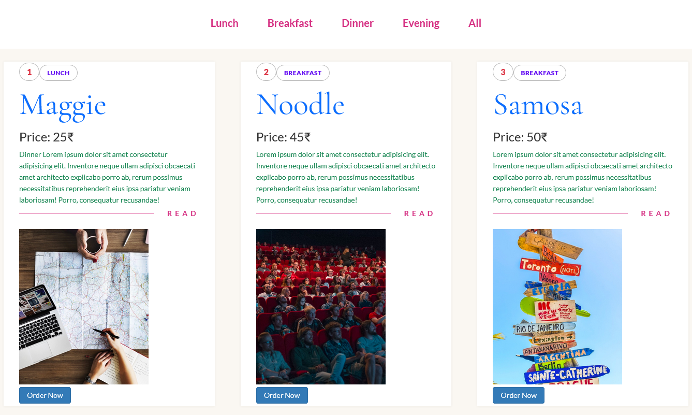

# Getting Started with React Projects
## 1. Contact Forms with Firebase
1. This is a React component that allows users to `sign up`, `log in`, and `log in with Google` using `Firebase` authentication.
2. It imports necessary functions from the Firebase auth library and initializes the Firebase app with the provided configuration.
3. The component uses the `useState` hook to manage form data and updates the state when the user types in the input fields. The component also includes functions to `handle form` submissions for sign up, log in, and Google log in.
4. The component renders two forms for sign up and log in, respectively, and a `button` for Google log in. 

## 2. Restaurants With API Data:
  
1. This is a JavaScript file that defines a React component called `Restaurant`. 
2. It imports the `useState` hook and three other components (`Navbar`, `MenuCard`, and `myAPI`) from other files. 
3. It also creates a unique list of categories from the `myAPI` data using the `Set` object and the `map`
method.

## Available Scripts
This project was bootstrapped with [Create React App](https://github.com/facebook/create-react-app). In the project directory, you can run:

### `npm start`

Runs the app in the development mode. Open [http://localhost:3000](http://localhost:3000) to view it in your browser.

### `npm test`

Launches the test runner in the interactive watch mode. See the section about [running tests](https://facebook.github.io/create-react-app/docs/running-tests) for more information.

### `npm run build`

Builds the app for production to the `build` folder. See the section about [deployment](https://facebook.github.io/create-react-app/docs/deployment) for more information.
